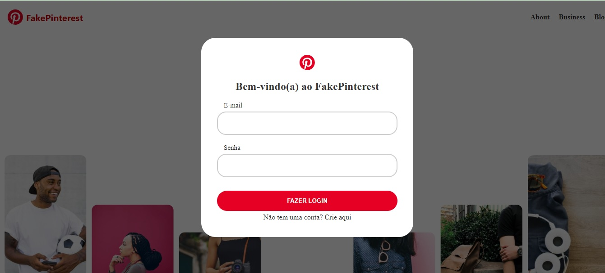

# FakePinterest 🌟

Uma réplica do Pinterest construída com Flask e Python, onde os usuários podem se cadastrar, fazer login e compartilhar seus próprios pins.

## 🚀 Tecnologias Usadas

- **Backend:** Flask
- **Banco de Dados:** SQLite
- **Frontend:** HTML, CSS
- **Bibliotecas:** 
  - Flask-Bcrypt
  - Flask-Login
  - Flask-SQLAlchemy
  - Flask-WTF

## 📸 Screenshots

  
*Visualização da página inicial*


## 🛠 Funcionalidades

- **Cadastro de Usuários:** Permite que novos usuários criem contas.
- **Login e Logout:** Acesso seguro para usuários registrados.
- **Postagem de Pins:** Usuários podem criar e compartilhar suas postagens.
- **Perfil de Usuário:** Visualização e edição do perfil.

## 📋 Como Usar

1. Clone este repositório:
   ```bash
   git clone https://github.com/VitorCamposAds/Projeto_Fake_Pinterest.git
   ```
   
2. Navegue até o diretório do projeto:
   ```bash
   cd Projeto_Fake_Pinterest
   ```
   
3. Crie e ative um ambiente virtual:
   ```bash
   python -m venv venv
   source venv/Scripts/activate  # Windows
   # ou
   source venv/bin/activate  # macOS/Linux
   ```

4. Instale as dependências:
   ```bash
   pip install -r requirements.txt
   ```

5. Execute o aplicativo:
   ```bash
   python main.py
   ```

6. Acesse o aplicativo em seu navegador em: [http://127.0.0.1:5000](http://127.0.0.1:5000)

## 📧 Contato

- **E-mail:** vitorbeatle@gmail.com
- **LinkedIn:** [Vitor Campos](https://www.linkedin.com/in/vitor-campos-tech)

---

### Contribuições

Contribuições são bem-vindas! Sinta-se à vontade para abrir uma "issue" ou enviar um pull request.

Sinta-se à vontade para modificar conforme sua preferência!
